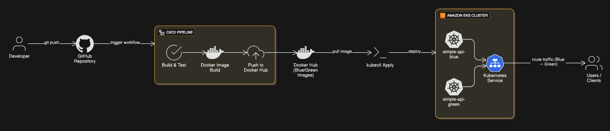

<<<<<<< HEAD
Simple API – EKS Blue‑Green Deployment on AWS

1. Overview

     This project demonstrates a production‑ready DevOps setup for a simple Python API deployed on Amazon EKS using Blue‑Green deployment and GitHub Actions CI/CD.
     The goal is to showcase containerization, Kubernetes deployment, CI/CD automation, monitoring, and security best practices.

2. Architecture Diagram
   

3. CI/CD Workflow Explanation
CI (Continuous Integration)

   Triggered on every push to the main branch:

    1.Checkout source code

    2.Setup Python environment

    3.Install dependencies and run unit tests

    4.Build Docker images:
       
          simple-api:blue

          simple-api:green

    5.Push images to Docker Hub      

CD (Continuous Deployment)

After CI success:

    1.Authenticate to AWS using GitHub Secrets

    2.Update kubeconfig for EKS cluster

    3.Deploy Blue version (if not present)

    4.Deploy Green version (new release)

    5.Wait for Green pods to become healthy

    6.Switch Kubernetes Service traffic to Green deployment

This approach ensures zero‑downtime deployments.

4. Deployment Steps
Prerequisites

    1.AWS Account

    2.EKS Cluster with worker nodes

    3.Docker Hub account

    4.GitHub repository

Steps

    1.Clone the repository

    2.Build and test locally (optional)

    3.Push code to main branch

    4.GitHub Actions pipeline runs automatically

    5.Application is deployed to EKS using Blue‑Green strategy    

Verify deployment:

    kubectl get deployments
 
    kubectl get pods
   
    kubectl get svc    

5. Monitoring & Alert Design
Monitoring

Amazon CloudWatch Container Insights enabled

    1Metrics collected:

    2.Pod CPU Utilization

    3.Pod Memory Utilization

    4.Pod status (Running / Failed)   

Dashboard

A CloudWatch dashboard visualizes:

    CPU usage per pod

    Memory usage per pod

    Pod health status 
Alerts

Two CloudWatch alarms are configured:

    High CPU / Memory Alert

       Trigger if utilization > 80%

    Health Check Failure Alert

       Trigger if pod enters Failed state  

6. Security Considerations
IAM Least Privilege

    1.Separate IAM role for EKS nodes

    2.GitHub Actions uses limited AWS credentials             

Optional Future Improvement

  IRSA (IAM Roles for Service Accounts)

    Pods can directly access AWS Secrets Manager

    Eliminates static secrets inside Kubernetes

7. Conclusion

This project demonstrates real‑world DevOps practices including CI/CD automation, Kubernetes Blue‑Green deployments, monitoring with CloudWatch, and secure secret management on AWS EKS.
